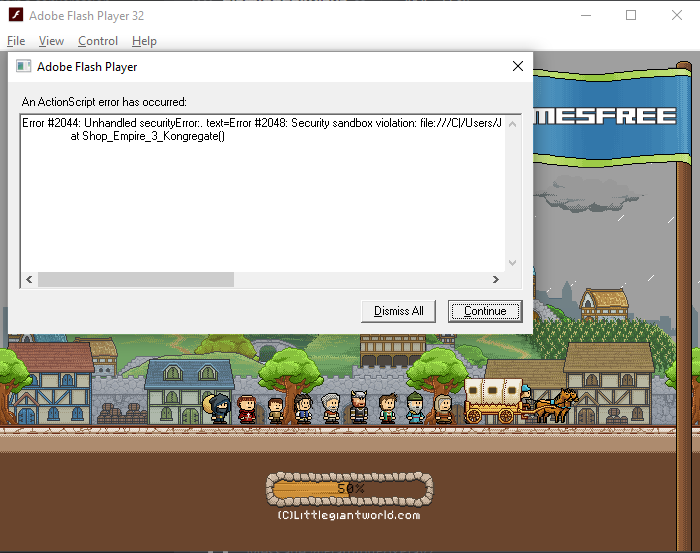

Hello! This repository is a decompiled version of a popular flash game known as Shop Empire 3. However, as of around
2016, the game broke. The issue included customers not buying anything, which is literally the entire revenue of the
game. Recently I decided to take a look. I had a few options as to why the game actually broke
 
### 1. Browser Flash Issues
This was the first thing to come to my head, and so I decided to install an old version of Mozilla Firefox. I got Firefox
40 and noticed that the browser didn't install the Flash NPAPI Plugin anymore. So I guess I cannot play Flash on it.

### 2. Flash Player Issue
Okay, maybe it's because the new Flash Players were an issue. I decided to try and install some older Flash
Players which worked fine. However, I noticed that the same issues still existed. So then how can it be broken?

### 3. The game was the issue
This one was one that I wasn't expecting to be the issue, but if it isn't the browser or the flash player, what could it
be? I decided to install a swf decompiler (using JPEXS Decompiler) and with Flash Player Content Projector (Debugger), I
started to play the game and got this error while starting it

Error #2044: Unhandled securityError:. text=Error #2048: Security sandbox violation: file:///C|/Users/[REDACTED]/Downloads/Shop%2DEmpire%2D3.swf cannot load data from http://gamedata.gamesfree.com/api-shop-empire-3.php.
at Shop_Empire_3_Kongregate()

##### Okay, so now what?

Well it seems that the game had ran into an issue trying to do a network request but how? I looked into the link and 
turns out the server domain is up for sale, and this (presumably) used to be a site for managing the amount of plays a
single flash game has and so this used to own to GamesFree and now they probably moved up to a better domain provider.

##### So how it does affect Flash?
Well turns out in order for Flash to make a network request it first checks for a file called 'crossdomain.xml', which
grants permission for a web client to handle data across domains as shown in this stackoverflow answer here
https://stackoverflow.com/questions/4174317/what-is-crossdomain-xml-file.

Because Flash Player cannot get this file, it defaults any requests to that domain as a "security risk" since we haven't
got "permission" and so the entire game is broken because of this

## Solutions

#### 1. Mozilla Firefox (flags)
I remember Mozilla Firefox having a flag which allowed flash to continue running even after security flags were exposed
and so I installed a super old version of Mozilla Firefox and to my (not really) surprise: Adobe Flash Player (NPAPI) 
Plugin didn't install as Mozilla had already (presumably) taken the download links down. Okay then.

#### 2. Modify the game
This is where you (if you use ActionScript) come in. I've decompiled the .swf file and am still trying to find where the
error that was raised in the Flash Player 32 (debug) inside the code. Since I have 0 experience with ActionScript, I'm
kinda relying on the search feature to do something. 

So if you have any experience using ActionScript 3 and can contribute - please create a pull request. It will be greatly
appreciated.
